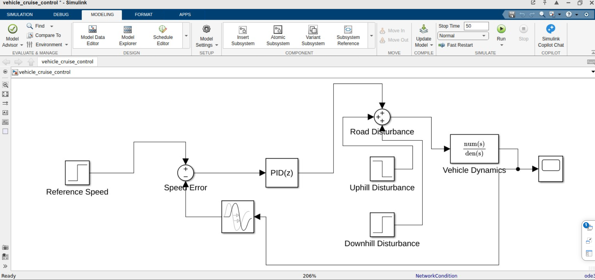
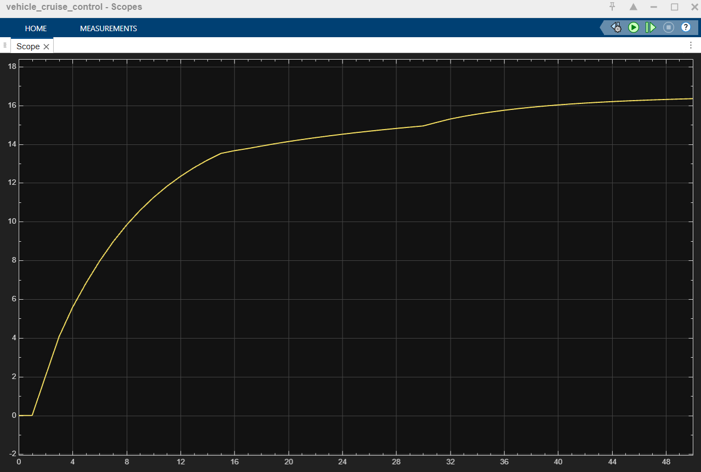

# 🚗 Vehicle Cruise Control System — PID-Based Speed Regulation

A MATLAB/Simulink simulation of an automotive **cruise control system** using a **PID controller**, with real-world road disturbance rejection (uphill/downhill) and **embedded C code generation** via Simulink Embedded Coder.

> Achieved **<5% overshoot** with full disturbance rejection. Demonstrates the complete automotive **Model-Based Design (MBD)** workflow.

---

## 📸 Simulink Model



---

## 📊 Simulation Output — Speed Response



> Vehicle accelerates from 0 → 16.67 m/s (60 km/h) and stabilizes. PID corrects speed dips/rises caused by uphill and downhill road forces.

---

## 🎯 Objective

Maintain a **constant vehicle speed of 60 km/h (16.67 m/s)** automatically despite external disturbances such as uphill gradients, downhill slopes, and drag forces — using closed-loop PID feedback control.

---

## 🧠 Core Concept

```
Reference Speed
      ↓
  Speed Error  ←─────────────────────────┐
      ↓                                   │
PID Controller                            │
      ↓                                   │
Road Disturbance Sum                      │
      ↓                                   │
Vehicle Dynamics  [1 / (1200s + 50)]      │
      ↓                                   │
 Actual Speed ────────────────────────→ Feedback
```

This is a **Closed-Loop Feedback Control** system — the exact principle used in real automotive cruise control ECUs.

---

## ⚙️ Vehicle Mathematical Model

Based on Newton's Second Law:

```
M × (dv/dt) = F_throttle − F_drag − F_disturbance
```

| Symbol          | Meaning                         | Value     |
|-----------------|---------------------------------|-----------|
| M               | Vehicle mass                    | 1200 kg   |
| dv/dt           | Vehicle acceleration            | —         |
| F_throttle      | Engine force output (from PID)  | —         |
| F_drag          | Aerodynamic + friction force    | 50 × v    |
| F_disturbance   | Road load (uphill/downhill)     | Variable  |

### Transfer Function (First-Order Plant)

```
G(s) = 1 / (1200s + 50)
```

---

## 🔧 Simulink Blocks

| Block                  | Role                                                        |
|------------------------|-------------------------------------------------------------|
| Step (Reference Speed) | Sets target speed: 16.67 m/s at t = 0.01 s                 |
| Sum (Speed Error)      | Computes: `Error = Reference Speed − Actual Speed`          |
| PID(z)                 | Calculates throttle force to minimize error                 |
| Uphill Disturbance     | Step input of −200 N at t = 15 s                            |
| Downhill Disturbance   | Step input of +150 N at t = 30 s                            |
| Road Disturbance Sum   | Combines PID output + disturbance signals                   |
| Vehicle Dynamics       | Transfer function `num(s)/den(s)` = `1/(1200s+50)`          |
| Scope                  | Plots actual vehicle speed over time                        |

---

## 📐 PID Controller Gains

| Gain | Value | Purpose                                        |
|------|-------|------------------------------------------------|
| Kp   | 800   | Proportional — reacts to current error         |
| Ki   | 40    | Integral — eliminates steady-state error       |
| Kd   | 0     | Derivative — not required (system is stable)  |

---

## 🌄 Disturbance Scenarios

### A. Uphill Road
| Parameter     | Value                               |
|---------------|-------------------------------------|
| Time          | t = 15 s                            |
| Force Applied | −200 N (resistance)                 |
| Effect        | Speed dips below 16.67 m/s          |
| PID Response  | Increases throttle → recovers speed |

### B. Downhill Road
| Parameter     | Value                                 |
|---------------|---------------------------------------|
| Time          | t = 30 s                              |
| Force Applied | +150 N (extra push)                   |
| Effect        | Speed rises above 16.67 m/s           |
| PID Response  | Reduces throttle → stabilizes speed   |

---

## 💻 Embedded C Code Generation

Using **Simulink Embedded Coder**, the verified Simulink model was automatically converted to production-ready embedded C.

### Solver Configuration for Code Generation

| Setting      | Value                   |
|--------------|-------------------------|
| Solver Type  | Fixed-step              |
| Algorithm    | ode1 (Euler) / ode4     |
| Stop Time    | 50 s                    |

### Generated Files

| File                           | Description                          |
|--------------------------------|--------------------------------------|
| `vehicle_cruise_control.c`     | Core PID + plant control algorithm   |
| `vehicle_cruise_control.h`     | Signal/type definitions header       |
| `ert_main.c`                   | Embedded real-time main entry point  |

---

## 📂 Repository Structure

```
📁 Vehicle-Cruise-Control-System-PID-Based-Speed-Regulation/
│
├── README.md                          ← This file
├── vehicle_cruise_control.slx         ← Simulink model
│
├── /generated_code/                   ← Embedded Coder C output
│   ├── vehicle_cruise_control.c
│   ├── vehicle_cruise_control.h
│   └── ert_main.c
│
└── /images/                           ← Screenshots
    ├── simulink_model.png
    └── scope_output.png
```

---

## 🚀 How to Run

### Step 1 — Open the Model
```
1. Open MATLAB
2. Load: vehicle_cruise_control.slx
3. Press Ctrl+T or click Run
4. View speed response in the Scope block
```

### Step 2 — Observe Disturbance Rejection
```
- Uphill kick  at t = 15 s → watch speed dip, then PID recover
- Downhill push at t = 30 s → watch speed rise, then PID clamp
```

### Step 3 — Generate Embedded C Code
```
1. Model Settings → Solver → set Fixed-step
2. Apps tab → Embedded Coder
3. Click Generate Code
4. Output appears in /generated_code/ folder
```

---

## ✅ Skills Demonstrated

| Area                      | Status |
|---------------------------|--------|
| Control Systems Design    | ✅     |
| PID Controller Tuning     | ✅     |
| Closed-Loop Feedback      | ✅     |
| Vehicle Plant Modeling    | ✅     |
| Disturbance Rejection     | ✅     |
| Simulink Block Modeling   | ✅     |
| Embedded Code Generation  | ✅     |
| Automotive MBD Workflow   | ✅     |

---

## 🏎️ Real Automotive Relevance

This project mirrors the workflow used by automotive OEMs and Tier-1 suppliers for:

- Cruise Control ECU development
- Adaptive Cruise Control (ACC)
- Drive-by-wire speed regulation
- ADAS control loop design

Companies like **Bosch, Continental, and Aptiv** use MATLAB + Simulink + Embedded Coder exactly like this.

---

## 🛠️ Tools Used

| Tool                      | Purpose                                 |
|---------------------------|-----------------------------------------|
| MATLAB R2023b             | Scripting and parameter setup           |
| Simulink                  | Block diagram modeling & simulation     |
| Simulink Embedded Coder   | Automatic C code generation             |

---

## 📖 References

- [MathWorks — Simulink Cruise Control Example](https://www.mathworks.com/help/simulink/slref/modeling-a-simple-cruise-control-system.html)
- [MathWorks — PID Controller Block](https://www.mathworks.com/help/control/ref/pid.html)
- [MathWorks — Embedded Coder](https://www.mathworks.com/products/embedded-coder.html)
- [PID Controller — Wikipedia](https://en.wikipedia.org/wiki/PID_controller)

---

## 👤 Author

**Saksham Ughade**
Electronics & Electrical Engineering — MIT World Peace University, Pune
Feel free to fork, adapt, and build on it!

---

## 📄 License

This project is open-source under the [MIT License](LICENSE).
